# Wardrobe Assistant – AI-Powered Fashion Recommendation System

**Wardrobe Assistant** is an intelligent fashion recommendation system that leverages machine learning to classify and suggest outfits based on style, context, and user preferences. Built with **FastAPI** and **Jinja2** templates, it provides a seamless web interface for personalized outfit recommendations.

---

## 📋 Project Overview

- **Objective**: Deliver tailored outfit suggestions using machine learning models for categorization and personalization.
- **Dataset**: Web-scraped product catalog with 5,443 entries and 19 features.
- **Tech Stack**: FastAPI, Pandas, Scikit-learn, CatBoost, KNN, Jinja2, HTML/CSS, Jupyter Notebooks.
- **Deployment**: Web application accessible via a browser.

---

## 📊 Dataset Details

- **Shape**: `(5,443, 19)`
- **Source**: Web-scraped fashion product catalog
- **Key Features**:
  | Column Name         | Description                              |
  |---------------------|------------------------------------------|
  | `product_name`      | Name of the fashion item                 |
  | `main_category`     | Primary clothing category                |
  | `color`             | Primary color of the item                |
  | `occasion`          | Suitable event (e.g., Festive, Casual)   |
  | `season`            | Ideal season (e.g., Spring, Winter)      |
  | `price_pkr`         | Price in Pakistani Rupees (PKR)          |
  | `discount`          | Discount percentage                      |
  | `Gender`            | Target gender (inferred)                 |
  | `categorize_outfit` | ML-assigned outfit type                  |
  | `fabric`            | Material of the item (e.g., Silk, Cotton)|

---

## 🗂 Project Structure

```plaintext
Wardrobe-Assistant/
├── data/
│   └── wardrobe_assistant.csv
├── models/
│   └── knn_wardrobe_pipeline.pkl
├── notebooks/
│   ├── clean_dataset.ipynb
│   └── model_training.ipynb
├── src/
│   ├── app.py
│   └── functions.py
├── templates/
│   ├── index.html
│   ├── contact.html
│   ├── documentation.html
│   ├── how_it_works.html
│   ├── recommended.html
│   └── features.html
├── static/
│   └── css/
│   └── images/
├── requirements.txt
└── README.md
```

---

## 🚀 Getting Started

### Prerequisites

- **Python**: 3.11.13
- **Dependencies**: Listed in `requirements.txt`

### Installation

1. **Clone the Repository**:
   ```bash
   git clone https://github.com/mshahzaib4/Wardrobe-Assistant.git
   cd Wardrobe-Assistant
   ```

2. **Set Up Virtual Environment**:
   ```bash
   python -m venv venv
   source venv/bin/activate  # Windows: venv\Scripts\activate
   ```

3. **Install Dependencies**:
   ```bash
   pip install -r requirements.txt
   ```

4. **Launch the Application**:
   ```bash
   uvicorn src.app:app --reload
   ```

5. **Access the Web App**:
   Open your browser and navigate to [http://127.0.0.1:8000/](http://127.0.0.1:8000/).

---

## 🌟 Features

- **Outfit Recommendations**: Personalized suggestions based on gender, season, occasion, and style.
- **Machine Learning Pipeline**: Preprocessing, classification, and similarity search using KNN and CatBoost.
- **Data Preprocessing**: Cleaning and normalization with `Sort_column` function.
- **Visualization**: Interactive insights using Matplotlib and Plotly.
- **Web Interface**: Dynamic UI built with FastAPI and Jinja2 templates.
- **API Endpoints**: RESTful routes for seamless interaction.

---

## 🧠 Machine Learning Pipeline

### Preprocessing
- **Function**: `Sort_column(df: pd.DataFrame) -> pd.DataFrame`
- **Tasks**: Data cleaning, normalization, and feature engineering for gender, season, outfit type, and price brackets.

### Models
- **KNN**: Similarity-based outfit matching.
- **CatBoostClassifier**: Outfit type classification.
- **MissForest**: Imputation of missing values.

### Visualization
- Tools: Matplotlib, Plotly
- Purpose: Exploratory data analysis and model performance evaluation.

---

## 🔗 API Routes

| Route              | Description                           |
|--------------------|---------------------------------------|
| `/`                | Home page                             |
| `/recommended`     | Outfit recommendation interface       |
| `/features`        | Overview of application features      |
| `/contact`         | Contact information                   |
| `/documentation`   | API and model documentation           |
| `/how_it_works`    | Explanation of the ML pipeline        |

---

## 📸 Screenshots

### 🏠 Home Page

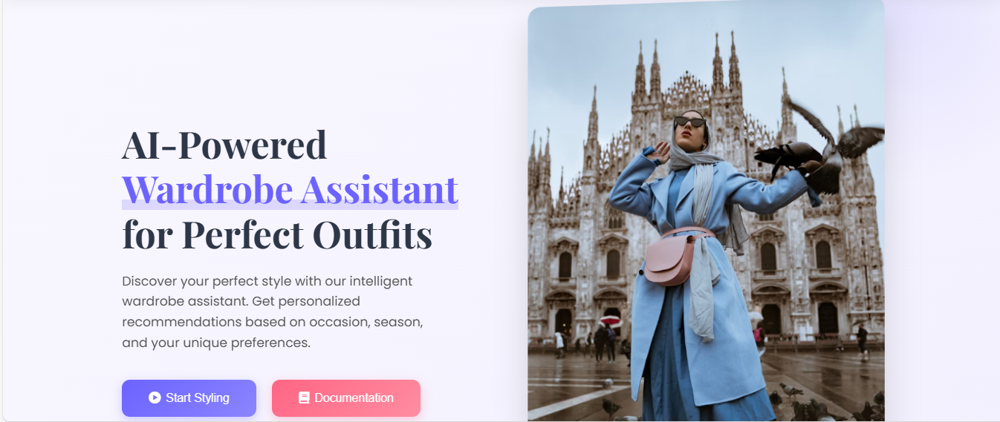
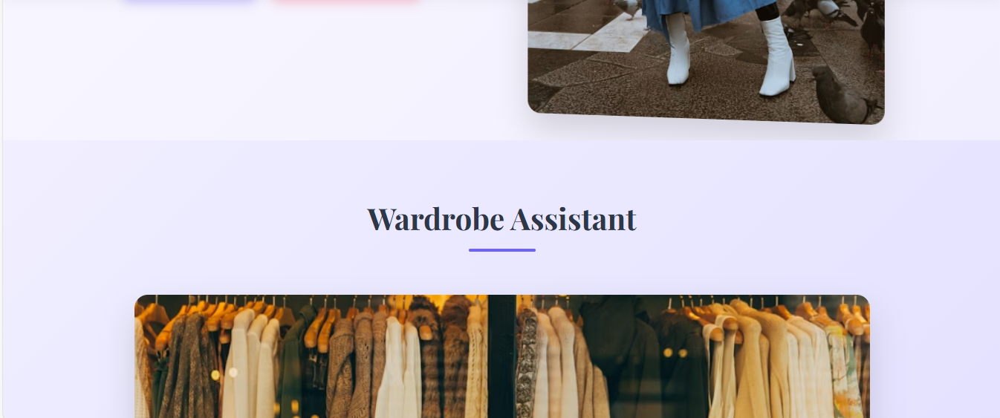
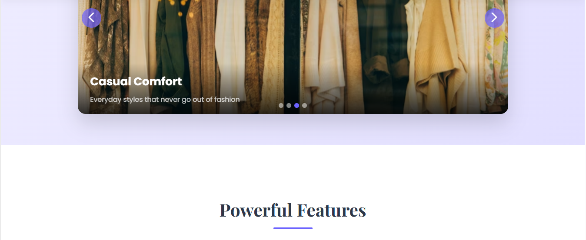
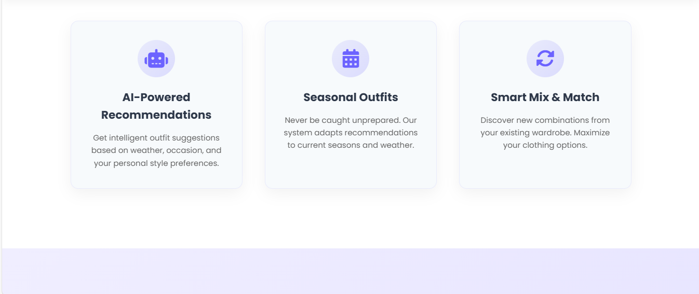


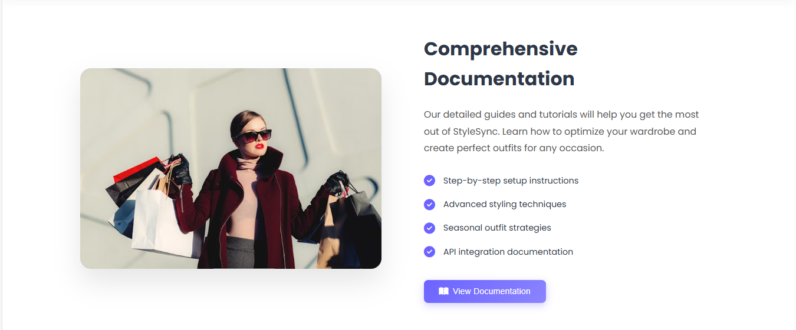
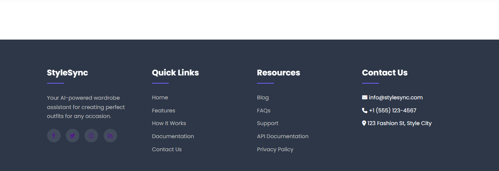


### 🏠 Form Page
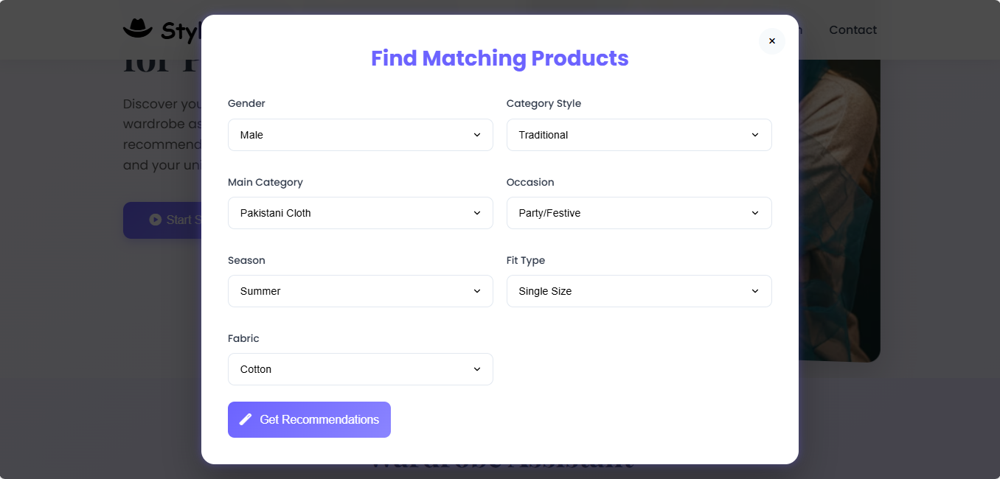

### 👗 Outfit Recommendations

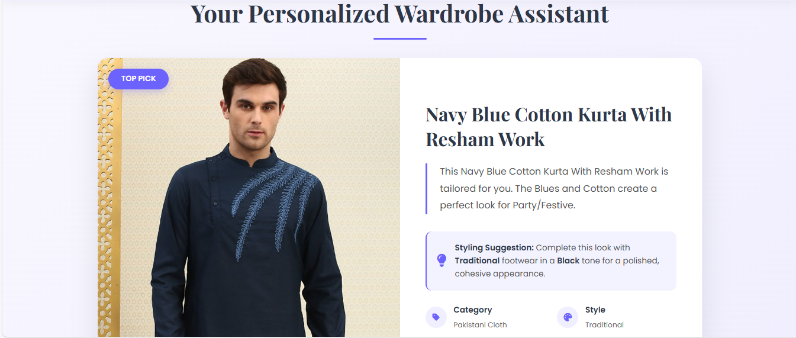
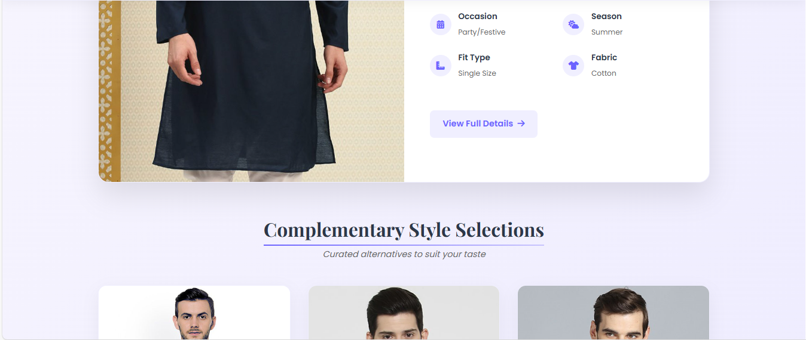
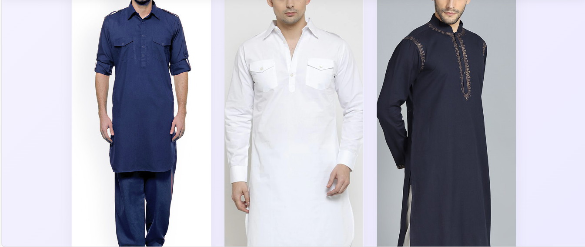
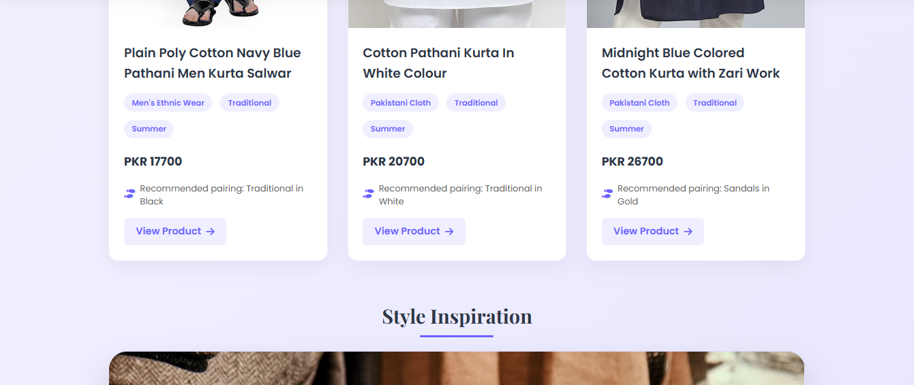
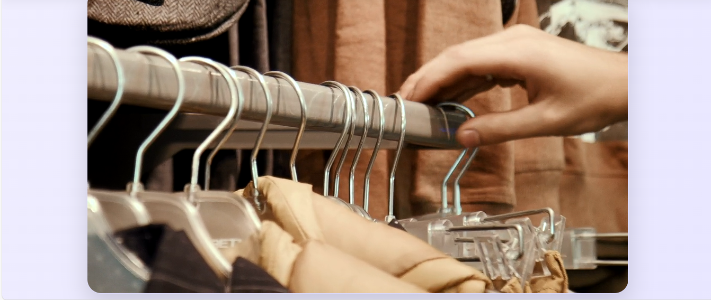
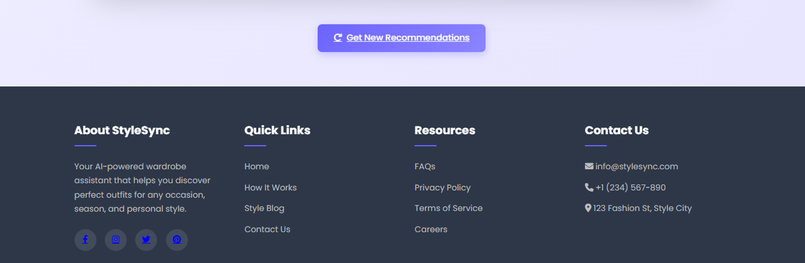


---

## 📦 Dependencies

### Core Libraries
- `fastapi==0.116.0`
- `uvicorn==0.35.0`
- `pandas==2.3.0`
- `catboost==1.2.8`
- `scikit-learn==1.7.0`
- `jinja2==3.1.6`

### Additional Libraries
- `matplotlib`, `plotly`
- `lightgbm`, `MissForest`, `tqdm`
- `python-dotenv`, `httpx`

Install all dependencies:
```bash
pip install -r requirements.txt
```

---

## 🤝 Contributing

We welcome contributions to enhance Wardrobe Assistant! Follow these steps:

1. **Fork the Repository**:
   ```bash
   git clone https://github.com/mshahzaib4/Wardrobe-Assistant.git
   ```

2. **Create a Feature Branch**:
   ```bash
   git checkout -b feature/your-feature-name
   ```

3. **Commit Changes**:
   ```bash
   git commit -m "Add your message"
   ```

4. **Push to Your Fork**:
   ```bash
   git push origin feature/your-feature-name
   ```

5. **Submit a Pull Request**:
   Ensure your code adheres to the project's style guide and includes relevant tests.

---

## 📜 License

This project is licensed under the **MIT License**. See the [LICENSE](LICENSE) file for details.

---

## 📬 Contact

**Shahzaib Yaqoob**  
AI/ML Engineer | Data Analyst  
📧 [shahzaibyaqoob0448@gmail.com](mailto:shahzaibyaqoob0448@gmail.com)  
📍 Narowal, Pakistan  

### Connect
- [LinkedIn](https://www.linkedin.com/in/shahzaibyaqoob/)  
- [GitHub](https://github.com/mshahzaib4)  
- [Kaggle](https://kaggle.com/shahzaibmalik44)  
